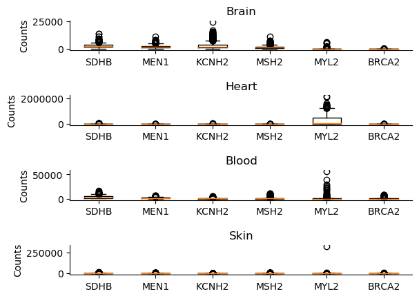

# Workflow
This project will produce a workflow in a Snakefile that takes the GTEx dataset and produces a series of boxplot corresponding to the gene counts of inputed genes in certain sample types. 

The first script, get_gene_counts.py, takes a file and gene name and returns all the tissue samples with the corresponding gene counts. 

The second script, get_tissue_samples.py takes a sample attribute file and the tissue type of interest and returns a file with a list of all of the sample ids of that tissue type. 

Box.py will take files created from these two (as many as you like) and create a nice boxplot showing the gene counts of each tissue sample and gene pair.

The Snakemake file can be used to make a pipeline that will output this boxplot of any combination of tissues and genes inputed.